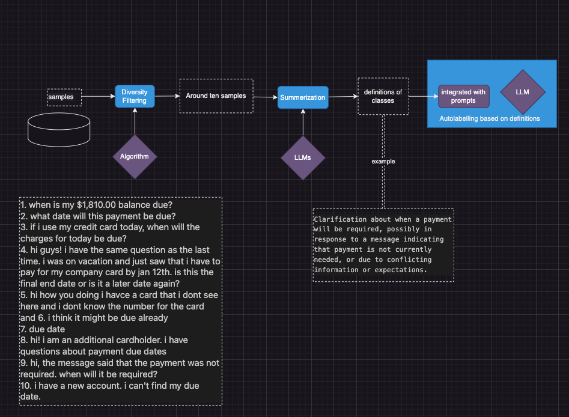

# llm_langchain_projects

llm_langchain_projects: Autolabelling, Search and Indexing

## Auto labelling Pipeline

#### outline of steps

+ step 1. Gather samples with same label. As many as possible.
+ Step 2. Using Diversity Filtering algorithm to reduce the size to around 5-20, while keep the diversity and comprehensivity
+ Step 3. Apply designed prompt and LLMs to summerize definition or generate labelling guildes from samples in step 2
+ Step 4. Integrate definitions and guides with prompts, schema, applying LLM to do auto labelling

